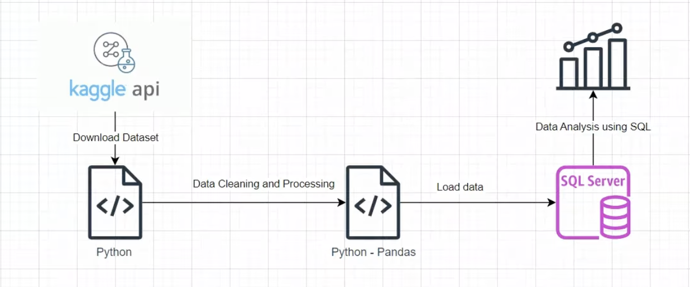

# Retail Orders Data Analytics Project

## 📌 Project Overview
This project demonstrates an end-to-end data analytics pipeline using Python, PostgreSQL, and SQL.

## 🔄 Project Workflow

## 🛠 Tools & Technologies
- Python
- Pandas
- PostgreSQL
- SQL
- Kaggle API

## 🔄 Project Workflow
1. Downloaded dataset using Kaggle API
2. Cleaned and processed data using Python & Pandas
3. Loaded cleaned data into PostgreSQL
4. Performed data analysis using SQL

## 📊 Key Analysis
- Top 5 selling products by region
- Month-over-month sales comparison (2022 vs 2023)
- Highest growth sub-category
- Best performing category by month

## 📁 Dataset
Source: Kaggle – Retail Orders Dataset

## 👤 Author
Harshavardhan S
